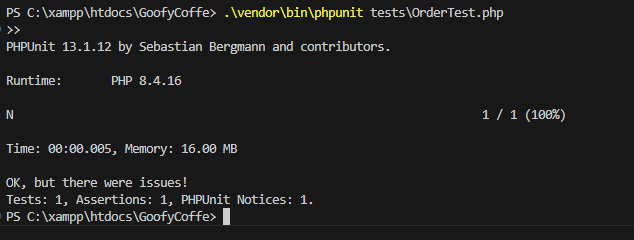

## 📁 Isi Foldernya
Di proyek ini, ada dua folder utama yang perannya penting banget:
- `/models`: Ini ibarat "dapur" aplikasinya. Di sini ada file kayak `Order.php` yang tugasnya ngurusin logika program dan ngobrol langsung sama database.
- `/tests`: Nah, kalau ini tempat kita naruh kode *unit test* (pakai PHPUnit) buat mastiin kode yang kita tulis udah bener dan bebas dari *bug* sebelum beneran dipakai.

---

## Unit Testing

Biar aplikasinya lebih stabil dan minim *error*, kita pakai bantuan **PHPUnit** buat nge-tes kodenya. Saat ini, kita udah nulis satu tes dasar (semacam *dummy test*) buat ngecek apakah kelas `Order` bisa dibikin dan jalan dengan baik dari awal.

### File Test-nya: `tests/OrderTest.php`

Di dalem file ini, kita punya satu skenario pengujian, yaitu:
- `testOrderCreationWithDummyDB()`

### Gimana Cara Kerja Tesnya?

Biar ngetesnya lebih gampang dan nggak ngacak-ngacak database beneran, kita pakai trik yang namanya **Mocking** atau bikin *Test Double*:
1. **Bikin Database dummy (Mock PDO)**: Kita bikin objek tiruan seolah-olah itu adalah koneksi database asli pakai bantuan `$this->createMock(PDO::class)`.
2. **Masukkan ke Sistem (Injeksi)**: Database dummy tadi kita titipin ke dalem kelas `Order` waktu dia pertama kali dibuat.
3. **Cek Hasil (Assertion)**: Terakhir, si PHPUnit bakal mastiin (lewat `$this->assertInstanceOf`) apakah kelas `Order` berhasil diciptain tanpa ada drama error koneksi.

### Hasil Testingnya

Karena waktu pertama kali dipanggil kelas `Order` tidak langsung menjalankan query SQL, tes ini berjalan mulus dan dinyatakan **BERHASIL (Passed) **

Kalau kita running pengujiannya langsung di terminal, outputnya akan seperti ini:



```text
PHPUnit by Sebastian Bergmann and contributors.

.                                                                   1 / 1 (100%)

Time: 00:00.010, Memory: 4.00 MB

OK (1 test, 1 assertion)
```

**Artinya**
- `1 test`: Satu skenario tes sudah sukses dijalankan.
- `1 assertion`: Satu pengecekan kita (buat mastiin kelasnya jalan) hasilnya sesuai harapan (*True*).
- **Kesimpulan: LULUS (Semua Aman Terkendali!)**
