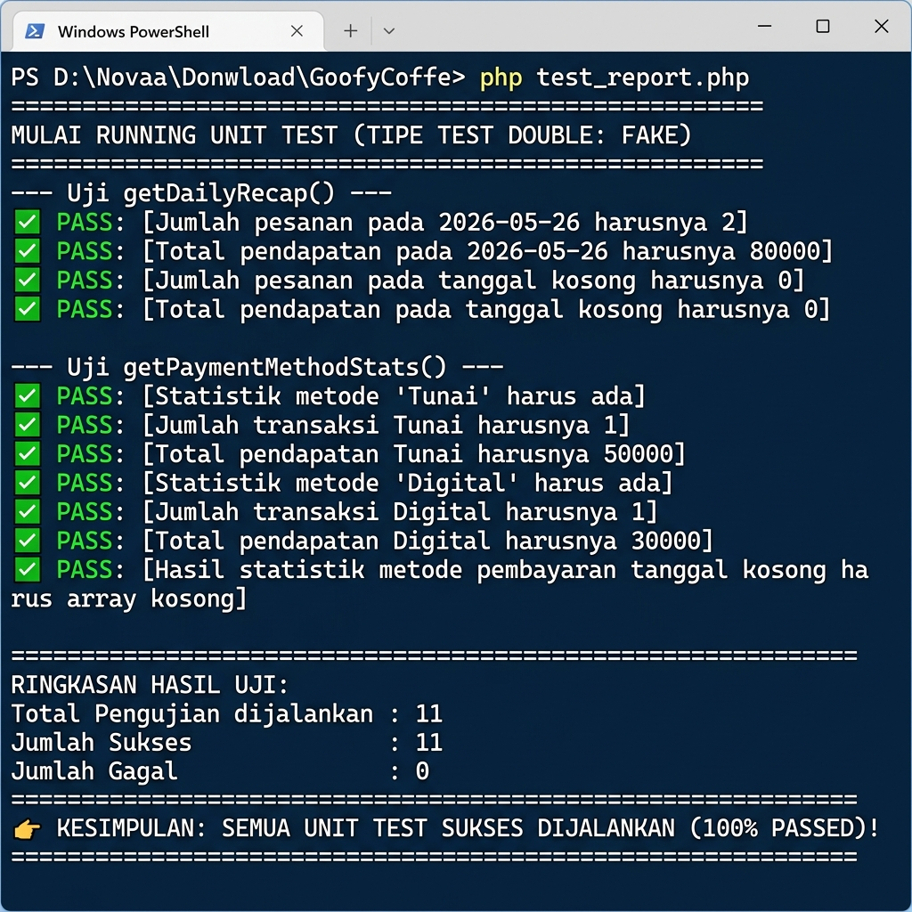

# Tugas Unit Testing - Desain Perangkat Lunak
**Pengujian Model Report Menggunakan Fake Database (Test Double)**

* **Nama Anggota** : Dianda Naufal Rahmanda
* **NIM**          : 202310370311365
* **Project**      : Goofy Cafe

---

## 📌 Deskripsi Tugas
Melakukan pengujian unit (*Unit Testing*) pada source code project menggunakan salah satu tipe *Test Double*, yaitu **Fake**. 
Pengujian difokuskan pada model **`Report`** (`models/Report.php`) yang bertanggung jawab untuk menghitung rekapitulasi harian dan mengelompokkan statistik metode pembayaran.

---

## 🔍 Konsep Test Double: Fake Database
**Test Double** adalah objek tiruan yang menggantikan objek asli (seperti database atau API) dalam unit testing untuk mengisolasi unit kode yang sedang diuji agar pengujian berjalan cepat, independen, dan konsisten.

Dalam tugas ini, tipe yang digunakan adalah **Fake**:
* **Fake** adalah objek yang memiliki implementasi kerja penuh (fungsional), tetapi biasanya mengambil jalan pintas yang menyederhanakan proses asli (misalnya, melakukan operasi *in-memory* di RAM alih-alih melakukan I/O database MySQL asli).
* Dengan menggunakan **`FakePDO`** dan **`FakePDOStatement`**, pengujian tidak membutuhkan server MySQL aktif atau data riil di tabel. Data di-supply secara lokal melalui array, sehingga tes berjalan sangat cepat (< 1ms) dan deterministik.

---

## 📁 Struktur File Pengujian
Pengujian ini dirancang secara mandiri dalam **1 file** agar mempermudah pemeriksaan dan demonstrasi:
* **`test_report.php`**: Berisi definisi kelas *Fake Database* (`FakePDO` dan `FakePDOStatement`), inisialisasi model, data tiruan, asersi pengujian (*test cases*), serta fungsi penampil hasil uji.

---

## 🚀 Cara Menjalankan Unit Test

### 1. Melalui Command Line (CLI)
Buka terminal/command prompt pada direktori root project, lalu jalankan perintah berikut:
```bash
php test_report.php
```

## 📊 Hasil Pengujian (Test Results)
Berikut adalah log output dari eksekusi unit test pada file `test_report.php`:

```text
========================================================
MULAI RUNNING UNIT TEST (TIPE TEST DOUBLE: FAKE)
========================================================

--- Uji getDailyRecap() ---
✅ PASS: [Jumlah pesanan pada 2026-05-26 harusnya 2]
✅ PASS: [Total pendapatan pada 2026-05-26 harusnya 80000]
✅ PASS: [Jumlah pesanan pada tanggal kosong harusnya 0]
✅ PASS: [Total pendapatan pada tanggal kosong harusnya 0]

--- Uji getPaymentMethodStats() ---
✅ PASS: [Statistik metode 'Tunai' harus ada]
✅ PASS: [Jumlah transaksi Tunai harusnya 1]
✅ PASS: [Total pendapatan Tunai harusnya 50000]
✅ PASS: [Statistik metode 'Digital' harus ada]
✅ PASS: [Jumlah transaksi Digital harusnya 1]
✅ PASS: [Total pendapatan Digital harusnya 30000]
✅ PASS: [Hasil statistik metode pembayaran tanggal kosong harus array kosong]

========================================================
RINGKASAN HASIL UJI:
Total Pengujian dijalankan : 11
Jumlah Sukses              : 11
Jumlah Gagal               : 0
========================================================
👉 KESIMPULAN: SEMUA UNIT TEST SUKSES DIJALANKAN (100% PASSED)!
========================================================
```

### 📸 Screenshot Hasil Pengujian


---

## 🛠️ Penjelasan Implementasi Kode

### 1. Pembuatan Fake Connection (`FakePDO`)
Kelas ini bertindak sebagai pengganti kelas `PDO` bawaan PHP. Alih-alih menerima konfigurasi DSN/host/username database, ia menerima array data order mentah untuk disimpan di memori.
```php
class FakePDO {
    public $orders = [];

    public function __construct($orders = []) {
        $this->orders = $orders;
    }

    public function prepare($query) {
        return new FakePDOStatement($this, $query);
    }
}
```

### 2. Pengolahan Query secara In-Memory (`FakePDOStatement`)
Ketika model `Report` memanggil kueri SQL, `FakePDOStatement` akan memproses logika SQL tersebut menggunakan manipulasi array PHP:
```php
class FakePDOStatement {
    // ...
    public function execute($params = null) {
        $date = $this->params[':date'] ?? null;

        // Simulasi query getDailyRecap()
        if (strpos($this->query, 'total_revenue') !== false) {
            // Menghitung COUNT dan SUM data array yang berstatus 'Selesai' dan cocok tanggalnya
            // ...
        }
        // Simulasi query getPaymentMethodStats()
        elseif (strpos($this->query, 'GROUP BY payment_method') !== false) {
            // Mengelompokkan transaksi berdasarkan metode pembayaran
            // ...
        }
    }
}
```
